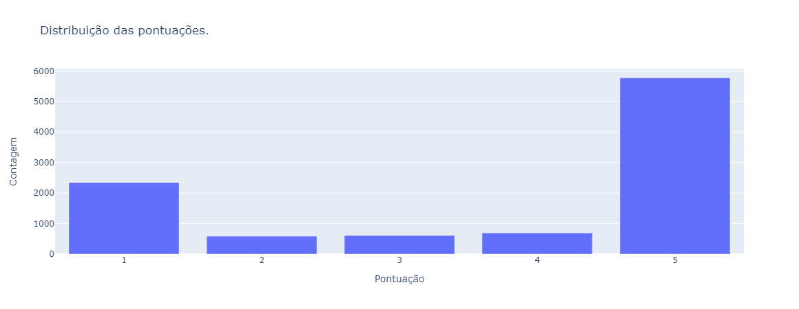
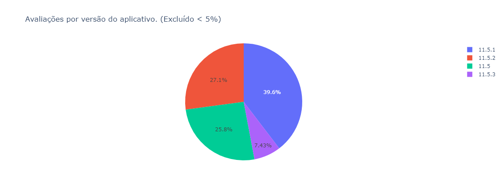
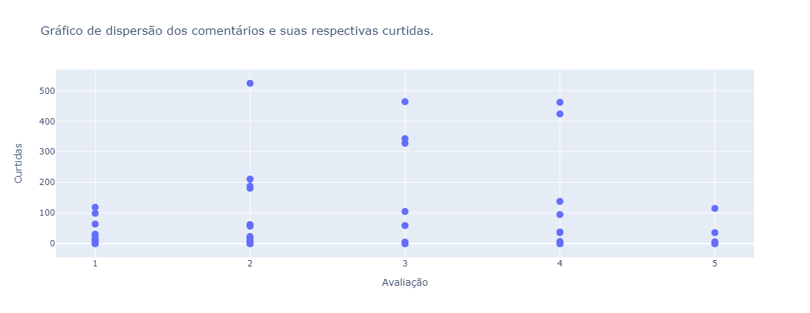

## Play Store App Reviews - Python

A ideia é pegar uma quantidade de avaliações dos usuários por aplicativo na Google Play Store e plotar gráficos que irão mostrar informações interessantes.

___
*Observação:* Alguns dados foram ocultados para preservar a segurança do usuário e manter a ética da análise. Não pegamos nome do usuário e nem sua foto.
___

### Exemplos de output.

